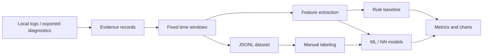
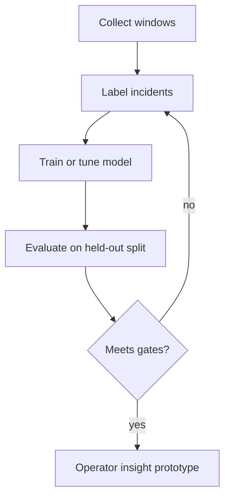

# AI Event Analysis Skill

`ai_event_analysis_skill` is a student-facing research and prototype skill for
measuring whether AI/ML methods improve operational event analysis in AdaOS.

The first iterations do not change AdaOS core. The skill uses the existing
declarative Web UI ABI, local file import, event-window samples, and a
deterministic rule-based baseline so the research task has a measurable starting
point without blocking core branches.

## Problem Statement

AdaOS is moving toward an operational event model where runtime, platform,
skill, browser, projection, and diagnostic signals are emitted as explicit
events and materialized through demanded projections.

The research task is to build and evaluate a model that analyzes a window of
operational events and predicts:

- whether the window contains an incident;
- the incident class;
- severity;
- confidence;
- the most important contributing signals.

The model must be evaluated against simple baselines instead of being judged by
subjective usefulness alone.

## Student Assignment

Title:

> Machine learning methods for anomaly detection and incident classification in
> the AdaOS operational event model.

Goal:

> Build a prototype that classifies operational event windows, compare a neural
> or classical ML approach with a rule-based baseline, and evaluate quality with
> reproducible metrics.

Input unit:

```json
{
  "window_id": "run-001:120-180s",
  "features": {
    "event_total": 128,
    "error_total": 8,
    "drop_total": 3,
    "projection_refresh_total": 42,
    "same_projection_refresh_max": 31,
    "yjs_write_total": 12,
    "browser_reconnect_total": 1,
    "member_disconnect_total": 0
  },
  "label": {
    "incident": true,
    "incident_type": "projection_refresh_storm",
    "severity": "warning",
    "reasons": ["same_projection_refresh_max", "projection_refresh_total"]
  }
}
```

Output unit:

```json
{
  "incident": true,
  "incident_type": "projection_refresh_storm",
  "severity": "warning",
  "confidence": 0.86,
  "reasons": ["same_projection_refresh_max", "projection_refresh_total"]
}
```

## Implementation Plan

### Phase 0. Skill Boundary

- [x] Keep all implementation inside `ai_event_analysis_skill`.
- [x] Avoid AdaOS core and core documentation changes in this branch.
- [x] Use only existing Web UI widgets and stream receivers.
- [x] Keep live stream publication best-effort so tools stay testable outside a
  running AdaOS runtime.

### Phase 1. Dataset Schema

- [x] Define `EventEvidenceRecord`, `EventWindowRecord`, labels, features, and
  prediction output.
- [x] Document privacy boundaries and redaction requirements.
- [x] Treat `node_id`, `subnet_id`, and `webspace_id` as dataset scope fields.
- [ ] Add schema-version migration checks when persisted datasets evolve.

See [Dataset Schema](docs/dataset-schema.md).

### Phase 2. Local Data Acquisition

- [x] Add `import_local_logs` for explicit log-file import.
- [x] Add safe local candidate discovery for common `.adaos` log locations.
- [x] Redact tokens, secrets, authorization headers, and local paths from log
  evidence.
- [x] Normalize local log lines into evidence records with timestamp, topic,
  severity, source, and message.
- [ ] Add import from `infrastate.events.recent` export files.
- [ ] Add import from reliability/status/projection snapshot exports.
- [ ] Add optional multi-node bundle import, where each node contributes its
  own evidence file with explicit `node_id`.

### Phase 3. Windowing And Features

- [x] Add `build_event_windows`.
- [x] Slice evidence into fixed time windows.
- [x] Compute basic feature families: event count, error count, eventbus
  pressure, projection refresh pressure, Yjs activity, browser reconnects,
  member disconnects, and runtime rebuild churn.
- [x] Attach top redacted evidence lines to each window.
- [x] Add baseline prediction to every imported unlabeled window.
- [ ] Add burst features such as max/sec, p95/sec, and repeated topic streaks.
- [ ] Add sequence features for ordered event-topic patterns.
- [ ] Add topology features for hub/member/subnet role.

### Phase 4. Dataset Export And Labeling

- [x] Add `export_event_windows_jsonl`.
- [x] Store exported datasets as JSONL by default under the skill data folder.
- [x] Add a Web UI `Windows` view for inspecting event-window rows.
- [ ] Add Web UI labeling actions for `incident_type`, severity, and reason
  codes.
- [ ] Add review state: unlabeled, reviewed, accepted, rejected.
- [ ] Add inter-annotator agreement metrics if several students/operators label
  the same dataset.

### Phase 5. Baselines And Metrics

- [x] Add a deterministic synthetic dataset for the first iteration.
- [x] Implement a rule-based baseline classifier.
- [x] Compute accuracy, macro-F1, per-class precision/recall/F1, false positive
  rate, critical recall, detection delay, and top-reason hit rate.
- [x] Publish evaluation results through an existing stream receiver.
- [ ] Add threshold tuning for the rule baseline.
- [ ] Add train/test split support for imported datasets.

### Phase 6. ML And Neural Models

- [ ] Add a classical ML baseline, for example logistic regression, random
  forest, or gradient boosting.
- [ ] Add model-card output with dataset version, feature set, split, and
  metrics.
- [ ] Add a neural sequence/window model, for example MLP, GRU/LSTM, or a small
  Transformer encoder.
- [ ] Compare all models against the same rule baseline.
- [ ] Add top-feature or top-signal explanations for every prediction.

### Phase 7. Operator Insight Prototype

- [x] Add baseline quality chart.
- [x] Add event-volume chart by event window.
- [x] Add class-distribution chart for baseline predictions.
- [ ] Group related windows into incident candidates.
- [ ] Generate operator summaries from incident candidates.
- [ ] Suggest the next diagnostic surface, such as logs, Yjs pressure, runtime
  reliability, or device inventory.
- [ ] Publish demanded `ai-summary:*` projections after the operational-event
  MVP gate accepts the canonical runtime path.

## Data Collection Strategy

Start with local logs and exported diagnostic snapshots. That gives real
operational texture without requiring a core change or a cross-node collector.

Recommended progression:

1. Local node datasets from `.adaos` logs and dev/test incidents.
2. Hub plus member-node bundles for subnet and remote-runtime classes.
3. Multi-subnet datasets only after privacy, redaction, and scope metadata are
   stable.

Multi-node data is useful because browser reconnects, member disconnects, Yjs
pressure, and update/rebuild churn can look similar in aggregate counts. The
dataset should keep `node_id`, `subnet_id`, and `webspace_id` explicit so a
model can learn topology-sensitive differences without mixing ownership.

The skill should not ingest raw secrets, full local paths, bearer tokens, or
large log bodies into training data. The default importer stores redacted
evidence excerpts plus aggregate features.

## Pipeline Diagram



## Evaluation Loop



## Success Criteria

Minimum first research milestone:

- dataset has at least 500 labeled windows;
- at least 5 incident classes plus `normal`;
- rule-based baseline is implemented and reproducible;
- ML/NN model is compared against the rule baseline;
- macro-F1 is at least `0.75` on a held-out test split;
- recall for critical incidents is at least `0.85`;
- false positive rate for normal windows is at most `0.15`;
- every prediction returns top contributing signals.

Stretch target:

- improve macro-F1 by at least `10%` relative to the rule baseline, or reduce
  average detection delay by at least `20%` at the same false-positive rate.

## Current Prototype

The skill currently ships:

- a synthetic benchmark dataset generator;
- local log import into redacted evidence records;
- fixed-window feature extraction;
- JSONL event-window export;
- a deterministic rule baseline;
- metric computation utilities;
- a Web UI app named `AI Event Analysis`;
- a `Windows` inspection view;
- baseline quality, event-volume, and class-distribution charts;
- a live stream receiver for demo evaluation and dataset-building results.

The prototype intentionally keeps model training out of the first iteration so
the measurement contract can stabilize before dependencies and runtime costs
are introduced.
